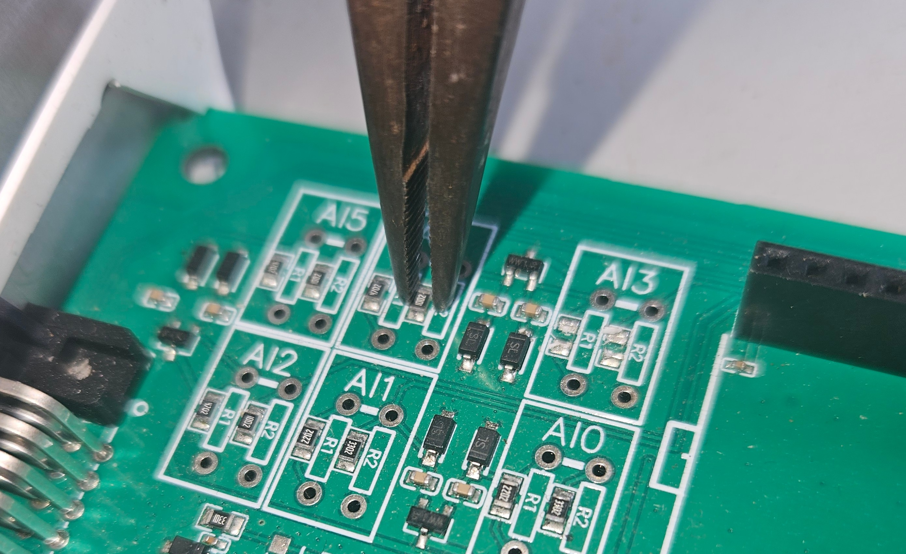
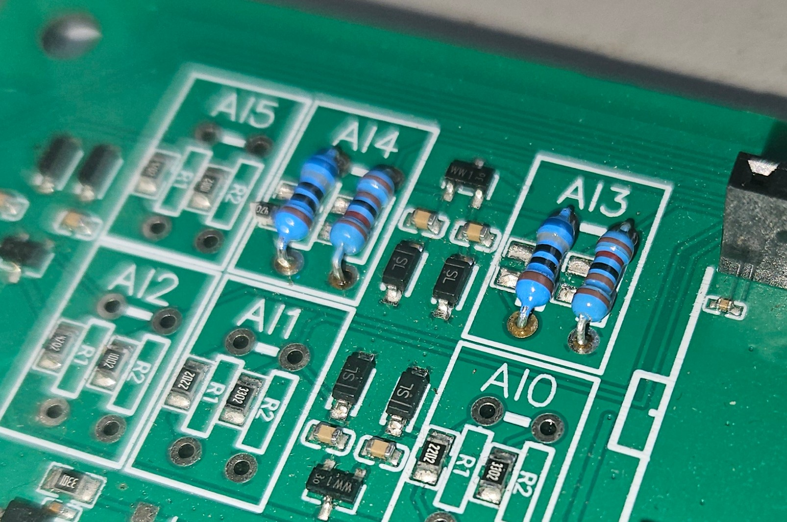
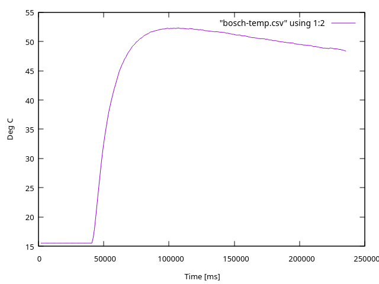

## Circuit modification

To read a Bosch Engine temperature sensor we need to modify the Analog Input circuit of the SPUD controller.

If we remove both SMDs and add two 1% resistors:

```text
5V ───────── [ NTC Thermistor ]
                    │
             [ Resistor 1: 680 Ω ]
                    │
                    ├─── Analog Input to Spud
                    │
             [ Resistor 2: 1.2 kΩ ]
                    │
                   GND
```

Then these values give:

 - At 0°C (R_NTC = 5,896): The analog input pin reads 0.77V
 - At 60°C (R_NTC = 596): The analog input pin reads 2.42V





## Results


